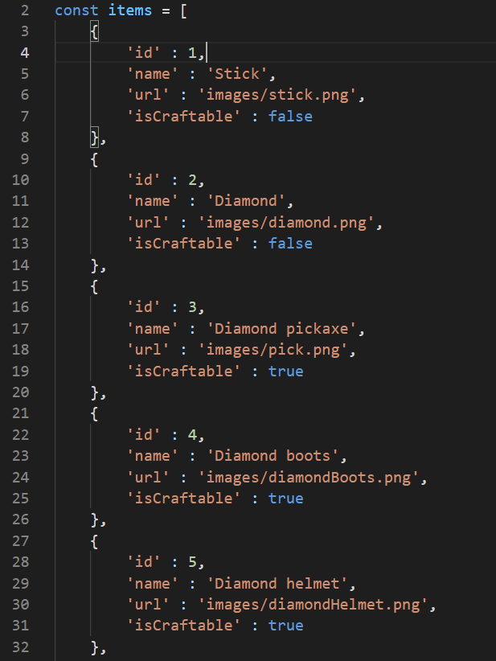
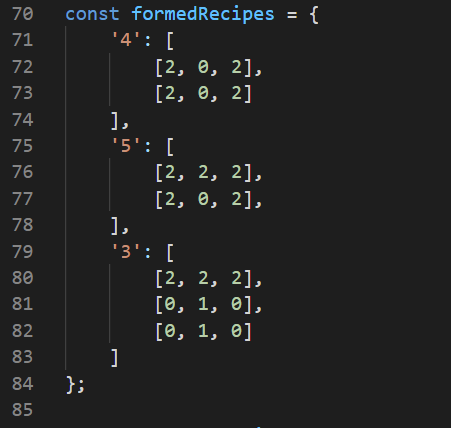

# Minecraft craft system js
## Проект представляет собой верстак из майнкрафта в браузере
### Попробуйте сами перейдя по данной ссылке : https://phanile.github.io/minecraft-craft-system-js/
## Как пользоваться?
Вы можете получить любой предмет с базы данных введя id предмета в соответствующее поле и во втром поле его количество:

Вы можете добавлять свои предметы в базу данных :

Все предметы храняться в файле itemsConfig в массиве items

Если значение поля 'isCraftable' стоит true то предмет можно скрафтить

Ключ - id крафтабельного предмета, значение - массив, включающий в себя ещё массивы, имитриующие строки в верстаке (то есть их максимум - 3).
Внутри массивов содержатся числа, это id предметов из которых состоит крафт. Если значение 0 - то там не должно быть предметов.
